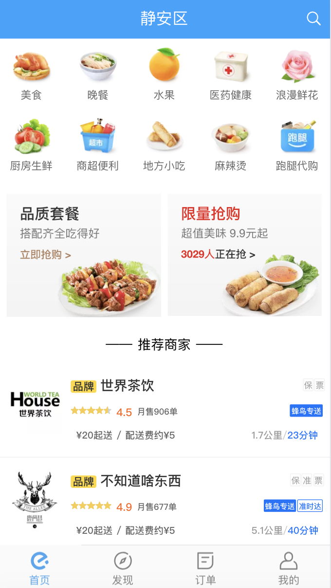
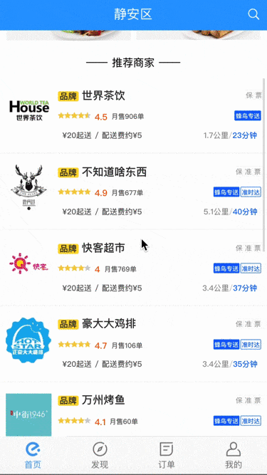
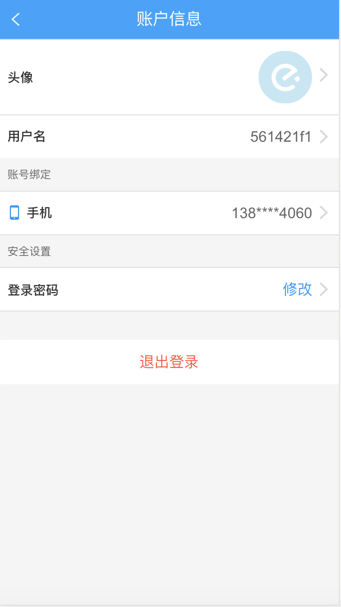
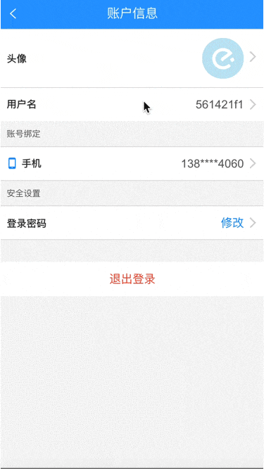
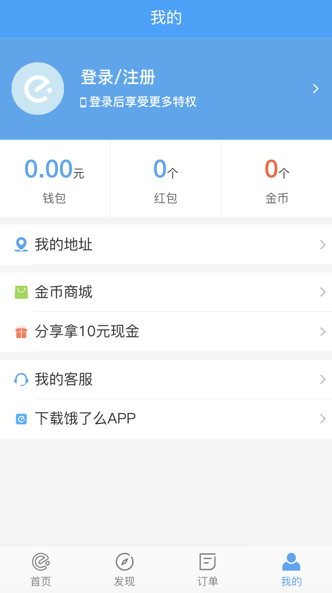
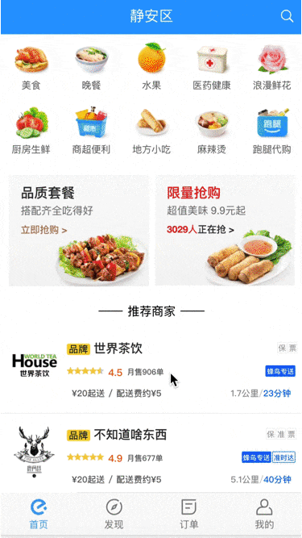
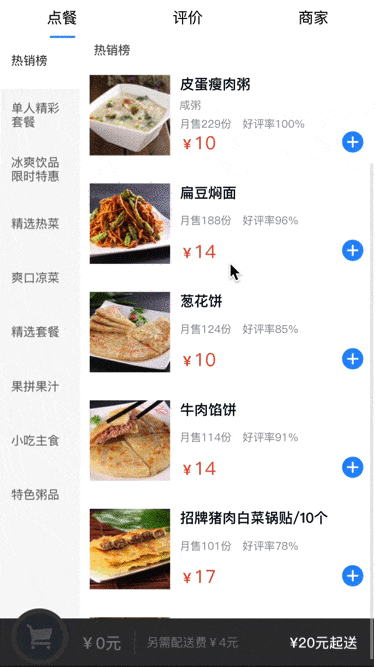
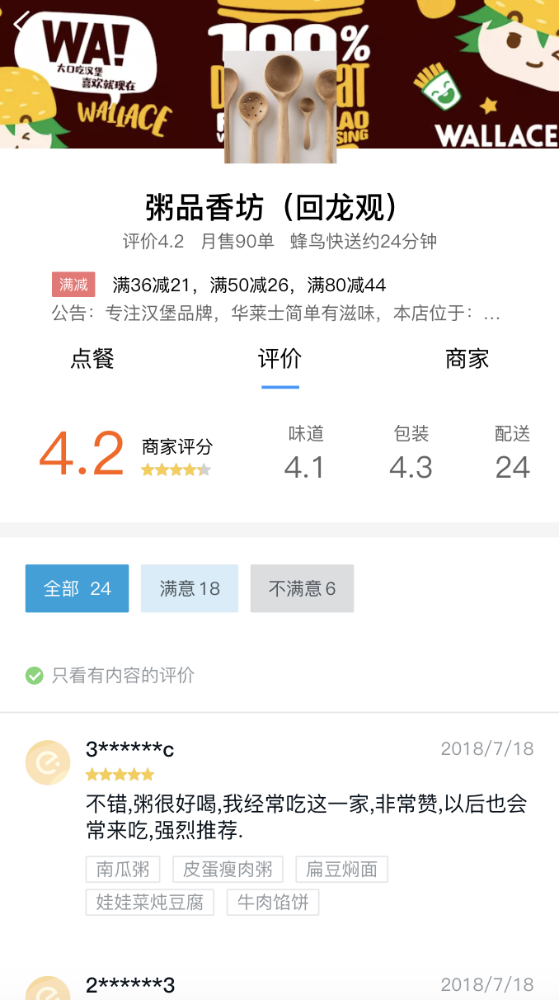
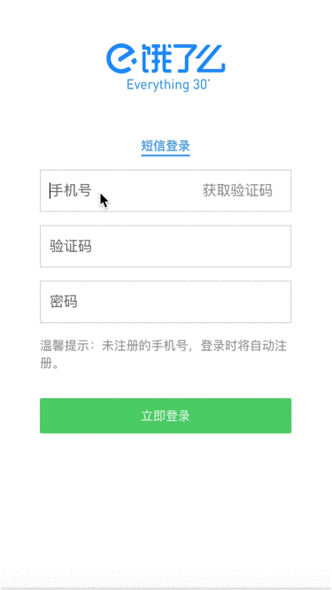

English | [简体中文](./README.md)

# Foreword

Use nuxt2 as the server rendering of vue, suitable for students who are just getting in touch or preparing for vue ssr reference and learning.
This project involves registration, login, product display, address management, etc., from front-end to back-end to final deployment to the server, allowing you to experience full-stack development to fun.

Note: The project is modeled after Hungry H5 version, refer to the latest UI of 2018, please choose hungry for the normal order. Official client.

If the network is not good, please move[Domestic mirror acceleration node](https://gitee.com/easytuan/nuxt-elm)

# Performance demonstration

[Check the demo please poke here](https://elm.caibowen.net/)（Please preview with chrome phone mode）

### The mobile side scans the QR code below


# API interface documentation

[Interface document address](https://easytuan.gitee.io/node-elm-api/doc)（based on apidoc）

# Technology stack

nuxt2 + vue + vuex + vue-router + mint-ui

## Project operation

```

git clone git@github.com:EasyTuan/nuxt-elm.git

# Domestic mirror acceleration node:git@gitee.com:easytuan/node-elm-api.git

cd nuxt-elm

npm install

npm run dev

# Template generation
npm run tep `文件名`

# pm2 deploy
npm run start

```

## supplement

This project has a supporting back-end system. If you want to experience the development of the front and back, you can download the corresponding back-end system:[Background project transfer address](https://github.com/EasyTuan/node-elm-api)。

If you only do front-end development, please ignore this sentence.


# Target function
- [x] Merchant list -- finished
- [x] Shopping cart -- finished
- [x] Restaurant food list -- finished
- [x] Store evaluation -- finished
- [x] Business details -- finished
- [x] log in Register -- finished
- [x] change Password -- finished
- [x] Personal center -- finished
- [x] Red envelope -- finished
- [x] Shipping address -- finished

# Business introduction

Directory Structure

    ├── assets
    │   ├── images
    │   ├── services
    │   ├── styles
    │   └── utils
    ├── components
    ├── config
    │   └── index.js
    ├── layouts
    ├── middleware
    ├── pages
    ├── plugins
    ├── static
    └── store


## Partial screenshot display

### Home show

 

### personal information

 

### mine

 

### Ordering

 

### Merchant evaluation

 

# Description

>  If it helps, you can click on the "Star" support in the upper right corner. Thank you！ ^_^

>  Or you can "follow" it, I will continue to open up more interesting projects.

>  If you have any questions, please do so directly in the Issues, or you find the problem and have a very good solution, welcome PR 👍

# Develop daily records

### nuxtTemplate building

Here about the project initialization, I am directly using the create-nuxt-app provided by the `Nuxt` official website.

```shell

# Make sure npx is installed (npx is installed by default in NPM version 5.2.0)：
npx create-nuxt-app <project name>

It will let you make some choices:
  1.Choose between integrated server-side frameworks:
    None (Nuxt Default server)
    Express
    Koa
    Hapi
    Feathers
    Micro
    Adonis (WIP)
  2.Choose your favorite UI framework:
    None (无)
    Bootstrap
    Vuetify
    Bulma
    Tailwind
    Element UI
    Buefy
  3.Choose the Nuxt mode you want (Universal or SPA)
  4.Add axios module To easily send HTTP requests to your application.
  5.Add EsLint Check your code with code specifications and errors when saving.
  6.Add Prettier To format/beautify your code when saving.

# Start local service
npm run dev

```

access http://localhost:3000 ,Now let's take a look at the initialized project directory.

Note: nuxt will read the vue file in the pages by default, and automatically generate routes. If you need to customize the route, you can configure the corresponding parameters in nuxt.config.js.。

### Request request encapsulation

The stripping of data and presentation layers is necessary, which is why the front end advocates the design pattern of MV*, and the request request encapsulation is our first step. Here I chose axios as the HTTP request client. Axios is compatible with the browser and node. It also provides request interception, response interception, etc., so that we can develop more enjoyable functions.

Written in `config/index.js`：

```
module.exports = {
  IS_RELEASE: true,

  BASE_URL: `http://localhost:3000/api`,

  // BASE_URL: `https://elm.caibowen.net/api`,

  // IMG_URL: 'http://localhost:9000/',

  IMG_URL: 'https://easytuan.gitee.io/node-elm-api/public/',

  HEADERS: {
    'Content-Type': 'application/json;charset=UTF-8'
  },

  TIMEOUT: 12000,

};

```

Written in `assets/utils/request.js`：

```

import axios from 'axios';
import config from '~/config';
import { Toast } from 'mint-ui';

axios.defaults.baseURL = config.BASE_URL;
axios.defaults.timeout = config.TIMEOUT;
axios.defaults.headers = config.HEADERS;

axios.interceptors.request.use( request => {
  if (!config.IS_RELEASE) {
    console.log(
      `${new Date().toLocaleString()}【 M=${request.url} 】P=`,
      request.params || request.data,
    );
  }
  return request;
}, error => {
  return Promise.reject(error);
});

export default async (options = { method: 'GET' }) => {
  let isdata = true;
  if (
    options.method.toUpperCase() !== 'POST'
    && options.method.toUpperCase() !== 'PUT'
    && options.method.toUpperCase() !== 'PATCH'
  ) {
    isdata = false;
  }
  const res = await axios({
    method: options.method,
    url: options.url,
    data: isdata ? options.data : null,
    params: !isdata ? options.data : null,
  });
  if (res.status >= 200 && res.status < 300) {
    if (!config.IS_RELEASE) {
      console.log(
        `${new Date().toLocaleString()}【接口响应：】`,
        res.data,
      );
    }
    // 浏览器环境弹出报错信息
    if(typeof window !== "undefined" && res.data.code !== 0) {
      Toast(res.data.msg);
    }
    return res.data;
  }else {
    if(typeof window !== "undefined" && res.data.code !== 0) {
      Toast('请求错误');
    }
  }

};

```

Finally, all api requests are written into the server.js file for easy unified management.

### Cross-domain processing

Students who have used `vue` will definitely know that for the cross-domain in the project, `vue-cli` encapsulates the `proxy` option in `webpack`. It exposes an option called `proxyTable`, which is an integration of `proxy` in `webpack` and its three-party plugin `http-proxy-middleware`.

Unfortunately, there is no `proxyTable` configuration item in `Nuxt` for cross-domain configuration. Fortunately, in `Nuxt` you can handle cross-domain directly by configuring `http-proxy-middleware`. Fortunately, `Nuxt` officially provides two packages to handle the `axios` cross-domain issue.

- [@nuxtjs/axios](https://www.npmjs.com/package/@nuxtjs/axios)
- [@nuxtjs/proxy](https://www.npmjs.com/package/@nuxtjs/proxy)

First, install it

```shell
npm i @nuxtjs/axios @nuxtjs/proxy -D
```

Then configure it in the `nuxt.config.js` file

```
  modules: [
    '@nuxtjs/axios',
    '@nuxtjs/proxy'
  ],
  proxy: [
    [
      '/api',{
        // target: 'http://localhost:9000',
        target: 'https://elm-api.caibowen.net',
        changeOrigin: true,
        pathRewrite: { '^/api' : '/' }
      }
    ]
  ],
```

Then you can use your axios for cross-domain requests with peace of mind.

### Project deployment

To this step, you must first make sure you have a server of your own. If not, hurry to buy one (I won't tell you that AWS and google cloud have a free one-year cloud server trial)


OK, the article continues. Before we explain the deployment, let’s take a look at the development commands.

| Command | Description |
| ------------- | ----------------------------------- ----- |
| dev | Start a hot-loaded web server (development mode) [localhost:3000](http://localhost:3000/) |
| start | Start a web server with pm2 daemon (`nuxt build` will be executed first) |
| generate | compile the application and generate the corresponding HTML file according to the routing configuration (for static site deployment) |


#### Start deployment


Upload the code to the server and execute the command npm run start to listen on port 3000.
Next, start configuring your nginx (for port forwarding)

```
 server {
  # Port, http is 80. If you deploy https, listen to 443.
  listen 80;
  server_name elm.caibowen.net;
  location / {
    proxy_pass http://localhost:3000;
  }
}
```

Then restart nginx

```
nginx -s restart
```

Then you can visit your website at http://elm.caibowen.net


### Last

For `Nuxt`, at the level of use, it is relatively simple and easy to use. Relative to vue-ssr, it greatly simplifies the development configuration, allowing developers to think about business development without worrying too much about file configuration. Among them, `Nuxt` directly ignores our usual configuration of routing by listening to the changes in the pages directory file and automatically generating routes.

However, the current `Nuxt` overall needs to be improved. At present, the community-related three-party plug-ins are relatively limited, and the related reference materials on the market are relatively small.

Anyway, I hope the `Nuxt` community can get better and better~

# Sponsorship

If you are helpful, welcome sponsorship

After receiving the sponsorship, I will promptly update the [sponsorship wall](https://caibowen.net/sponsor)

 

# Links

[Project background address](https://github.com/EasyTuan/node-elm-api)

# License

[GPL](LICENSE)
